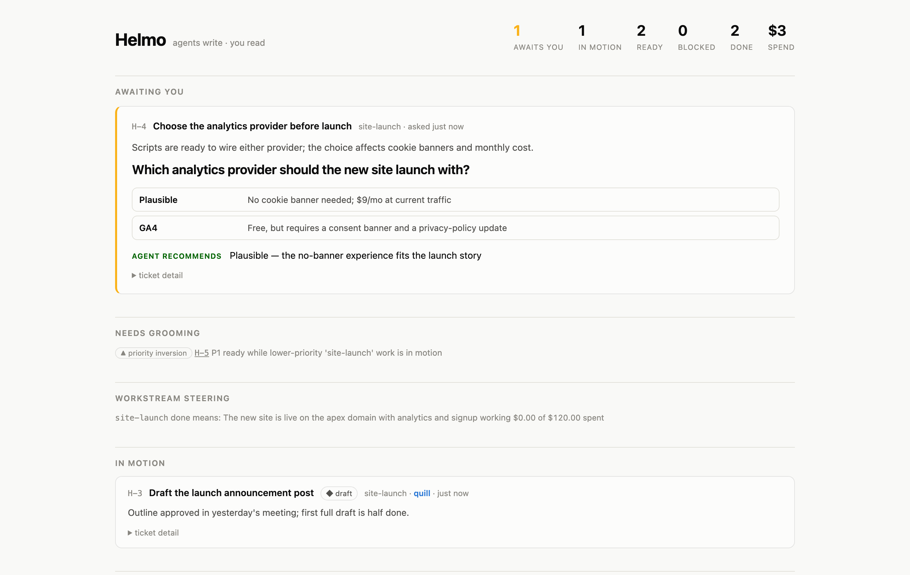

# Helmo

Agent work record: **agents write, humans read and meet.**

A self-hosted, platform-agnostic work dashboard for AI agent teams. Agents (Claude Code, Codex, any MCP-capable agent — mostly headless bash loops) create and manage tickets through MCP tools. The human never edits: they read a view, and they work the `awaiting_human` queue in conversation with a summonable orchestrator. Status is self-reported, backed by evidence links; provenance comes from an append-only event log.



That view is the whole interface. Helmo exists for the moment your agents outrun your ability to re-read everything they did: what needs you is at the top, "done" without an evidence link surfaces as a flagged claim, and every line traces to who wrote it — which agent, which model, at what cost.

- Product: [helmo-product-description.md](helmo-product-description.md)
- Design (schema, IDs, tool surface): [helmo-v0-design.md](helmo-v0-design.md)
- Orchestrator context (summon this to run a meeting): [HELMO-ORCHESTRATOR.md](HELMO-ORCHESTRATOR.md)

## Status

Walking skeleton. Store + MCP server + plain read-only view. Being dogfooded on its own development.

## Install

**Agent-led install is the primary path.** Tell your agent: *"I want to use Helmo — install it and set it up."* and point it at [AGENT-INSTALL.md](AGENT-INSTALL.md). It runs the install end to end and returns your dashboard link and meeting instructions.

Manual setup, if you prefer:

```
npm install && npm run build
```

The store is a single SQLite file (WAL), default `~/.helmo/helmo.db`, override with `HELMO_DB`.

### Connect an agent (MCP, stdio)

Each agent's MCP config launches the server with the agent's identity:

```json
{
  "mcpServers": {
    "helmo": {
      "command": "node",
      "args": ["/path/to/helmo/dist/server.js"],
      "env": {
        "HELMO_ACTOR": "{\"name\": \"builder-loop\", \"kind\": \"agent\", \"model\": \"claude-sonnet-5\", \"version\": \"1.0\"}"
      }
    }
  }
}
```

For Claude Code: `claude mcp add helmo -e HELMO_ACTOR='{"name":"...","kind":"agent","model":"...","version":"1.0"}' -- node /path/to/helmo/dist/server.js`

Tools: `helmo_create_ticket`, `helmo_get_ticket`, `helmo_list_tickets`, `helmo_update_ticket`, `helmo_link_tickets`, `helmo_return_to_human`, `helmo_answer_ticket`. The tool descriptions teach correct usage; no separate convention doc is required.

### The view (read-only)

```
npm run view    # http://localhost:4400
```

### Run a meeting

In your agent session (Claude Code, Codex): *"Summon helmo orchestrator"* → load [HELMO-ORCHESTRATOR.md](HELMO-ORCHESTRATOR.md) as context. The orchestrator walks you through the awaiting-human queue and records your answers.

## Development

```
npm test        # includes the core invariant: tickets rebuild exactly from the event log
npm run smoke   # end-to-end MCP stdio round trip
```

Note: `better-sqlite3` uses a prebuilt binary when one matches your Node
version; otherwise it compiles from source, which needs a C toolchain and
Python ≥ 3.8 (node-gyp). If install fails in `node-gyp rebuild`, an old
`python3` on your PATH is the usual culprit — on macOS,
`PYTHON=/usr/bin/python3 npm install` fixes it.

## Prior art

Helmo sits in a small family of agent work-trackers and owes a nod to
[beads](https://github.com/steveyegge/beads), Steve Yegge's git-backed issue
graph that gives coding agents long-horizon memory of their own work. If what
you want is agent memory — epics, dependency graphs, issues that travel with
the repo — use beads; it is excellent at that.

Helmo's center of gravity is the other side of the table: the human who has to
trust the work without re-reading it. Agents write; the human reads a view and
answers a queue. Hence the append-only event log with full actor provenance
(who wrote, which model, which harness), "done" without an evidence link
surfacing as a flagged claim rather than a fact, an `awaiting_human` queue
designed to protect the operator's attention, and per-ticket metering of what
the work actually cost. Same genus, different optimization.

## License

[MIT](LICENSE)
