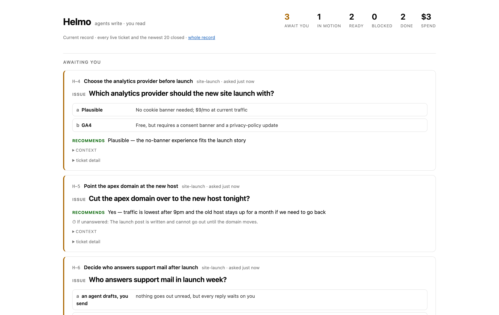

# Helmo

**Agents write, humans read and meet.** Helmo is a self-hosted work record for
AI agent teams, the roadmap above it, and the supervisor that keeps the agents
turning — one product, three areas, one version.



That view is the whole interface. Helmo exists for the moment your agents
outrun your ability to re-read everything they did: what needs you is at the
top, "done" without an evidence link surfaces as a flagged claim, and every
line traces to who wrote it — which agent, which model, at what cost.

| Area | What it is | Entry points | Store |
| --- | --- | --- | --- |
| [Work](packages/work/README.md) | Tickets agents write and the human reads; questions batched into meetings | `helmo-cli`, `helmo-mcp`, `helmo-view` (`:4400`) | `~/.helmo/helmo.db` |
| [Roadmap](packages/roadmap/README.md) | The layer above the ticket: parked, shaped, ranked, declared go | `roadmap-mcp`, `roadmap-view` (`:4410`) | `~/.helmo-roadmap/roadmap.db` |
| [Runtime](packages/runtime/README.md) | Process supervision for autonomous loops drawing work from Work | `rev`, `gp-rev`, the loop view (`:4500`) | sentinels under `~/.rev/` |
| [Core](packages/core) | Installation identity, install, qualified references, release selection, build stamps | — | — |

The two stores stay separate and unmigrated: together they read as one system,
apart each stands alone. Nothing a configuration file, a plist, a bookmark or a
loaded tool schema names changed when the three products became one.

## Status

**MVP, one version — `0.6.0`.** All three areas are dogfooded on this
product's own development. What the version number promises, and what counts as
a breaking change, is [VERSIONING.md](VERSIONING.md). The automated floor is
the root `npm run build` and `npm test`; independent review still gates
acceptance, and publication is a separate release decision. No 1.0 gate is
claimed.

## Install

**Agent-led install is the primary path.** Tell your agent: *"I want to use
Helmo — install it and set it up."* and point it at the install guide for the
area you want: [Work](packages/work/AGENT-INSTALL.md),
[Roadmap](packages/roadmap/AGENT-INSTALL.md),
[Runtime](packages/runtime/AGENT-INSTALL.md). Each runs end to end and returns
your links and getting-started instructions.

Manual setup, if you prefer:

```
git clone <this repository>
cd helmo
npm ci
npm run prepare:cold
npm run build
npm test
```

That is the isolated cold setup: it needs no sibling project and the tests use
fresh temporary databases. Node.js 20 or newer. A few design-source drift
comparisons report **skipped** when the private estate source is absent; the
vendored copies are still tested.

`npm run prepare:cold` marks a fresh git checkout as writable and refuses an
export or assembled release tree. The root build writes only into a checkout
carrying that ignored build marker — refusing
in any release directory and any checkout an installation resolves through, so
a build can never overwrite the code a running view or supervisor loads. It is
a deliberate speed bump that makes the choice explicit, not an authentication
boundary; `scripts/build.mjs` is the whole of it.

`better-sqlite3` uses a prebuilt binary when one matches your Node version;
otherwise it compiles from source, which needs a C toolchain and Python ≥ 3.8
(node-gyp). If install fails in `node-gyp rebuild`, an old `python3` on your
PATH is the usual culprit — on macOS, `PYTHON=/usr/bin/python3 npm install`
fixes it.

## Running more than one installation

One installation needs none of this. For more than one, or to change which
release one runs:

- [INSTALLATIONS.md](INSTALLATIONS.md) — install identity, pinned releases,
  upgrade, rollback and removal. An installation assembled from immutable
  releases sets `INSTALLATION_RELEASE` to its selection file; every entry point
  then verifies the selected commit and refuses to run from another checkout.
- [ENTRY-POINTS.md](ENTRY-POINTS.md) — the checklist of every path your setup
  names, and how to verify what is actually running rather than trust it.
- [ISOLATION-CHECKS.md](ISOLATION-CHECKS.md) — an independent review of those
  guarantees, with a two-installation checklist and the public tests.

## Connect an agent (MCP, stdio)

Each agent's MCP config launches the server with the agent's identity:

```json
{
  "mcpServers": {
    "helmo": {
      "command": "node",
      "args": ["/path/to/helmo/packages/work/dist/server.js"],
      "env": {
        "HELMO_ACTOR": "{\"name\": \"builder-loop\", \"kind\": \"agent\", \"model\": \"claude-sonnet-5\", \"version\": \"1.0\"}"
      }
    }
  }
}
```

Roadmap's server is `packages/roadmap/dist/server.js`, with `ROADMAP_ACTOR` or
the same `HELMO_ACTOR`. The tool descriptions teach correct usage; no separate
convention doc is required. Each area's README covers its own surface in
full — the work-record tool set, product acceptance and the workflow gate in
[Work](packages/work/README.md), derived rank and charters in
[Roadmap](packages/roadmap/README.md), and what an unattended loop session can
actually do in [Runtime](packages/runtime/README.md). Read that last one before
registering a loop.

## Run a meeting

In your agent session (Claude Code, Codex): *"Summon helmo orchestrator"* →
[HELMO-ORCHESTRATOR.md](packages/work/HELMO-ORCHESTRATOR.md) is loaded as
context. The orchestrator walks you through the awaiting-human queue and
records your answers. For the running machine, *"summon the watch officer"* →
[WATCH-OFFICER.md](packages/runtime/WATCH-OFFICER.md).
[AGENTS.md](AGENTS.md) routes every other kind of session.

## Development

```
npm test            # all four packages, including the invariant that every
                    # record rebuilds exactly from its event log
npm run build       # every package, in dependency order
```

[DEV.md](DEV.md) is the coding context for the repository as a whole; each area
has its own `DEV.md` for its internals. Changes are tracked in Helmo itself.

Bugs and feature requests go in this repository's issue tracker — one tracker
for all three areas. Security reports do not: use private vulnerability
reporting, per [SECURITY.md](SECURITY.md).

## Prior art

Helmo sits in a small family of agent work-trackers and owes a nod to
[beads](https://github.com/steveyegge/beads), Steve Yegge's git-backed issue
graph that gives coding agents long-horizon memory of their own work. If what
you want is agent memory — epics, dependency graphs, issues that travel with
the repo — use beads; it is excellent at that.

Helmo's center of gravity is the other side of the table: the human who has to
trust the work without re-reading it. Hence the append-only event log with full
actor provenance, "done" without an evidence link surfacing as a flagged claim
rather than a fact, an `awaiting_human` queue designed to protect the
operator's attention, and per-ticket metering of what the work actually cost.
Same genus, different optimization.

## License

[MIT](LICENSE). Third-party notices: [THIRD_PARTY_NOTICES.md](THIRD_PARTY_NOTICES.md).
